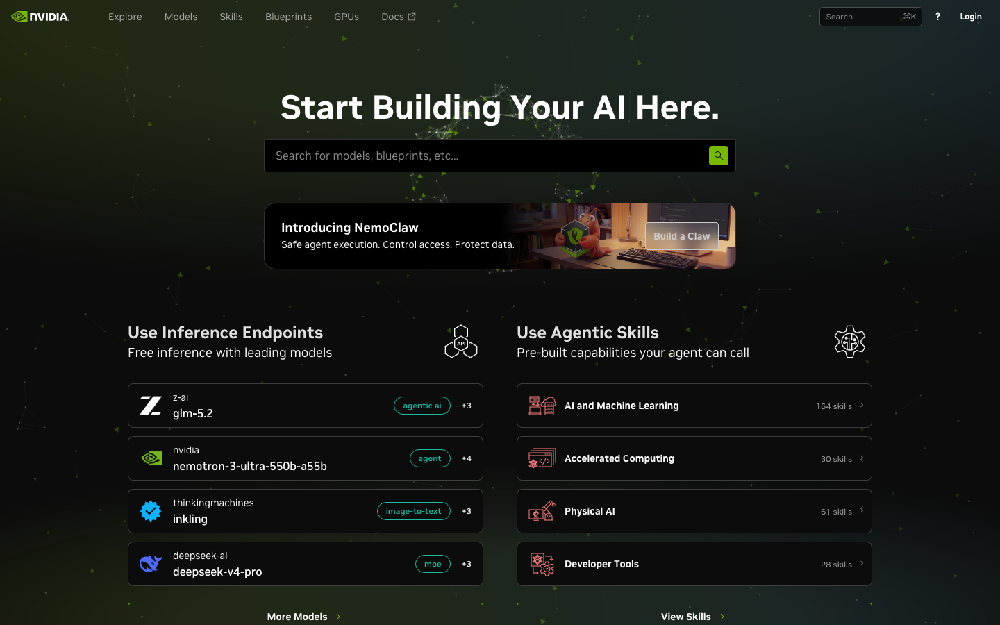
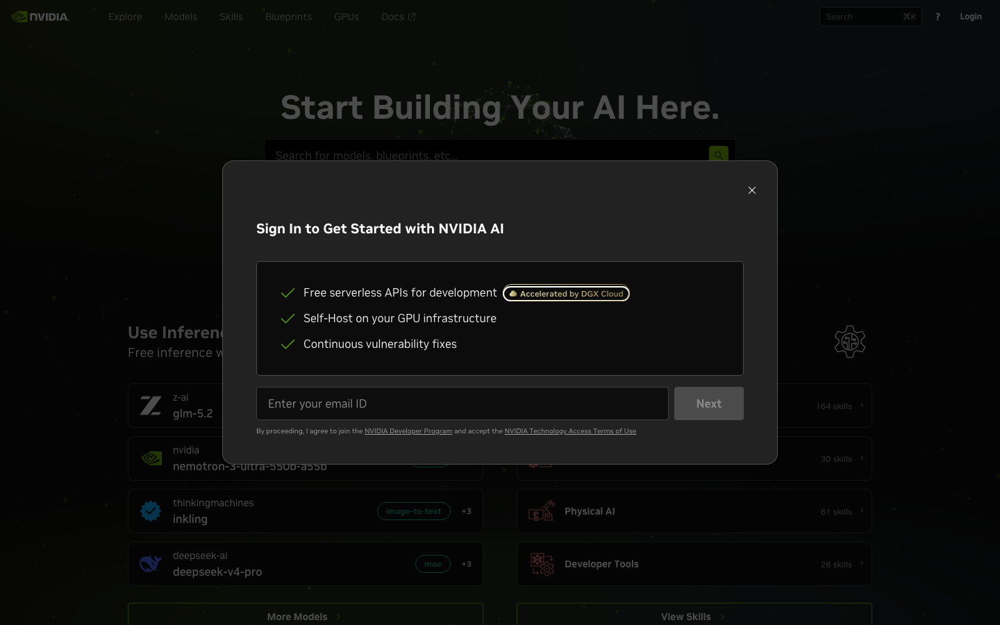
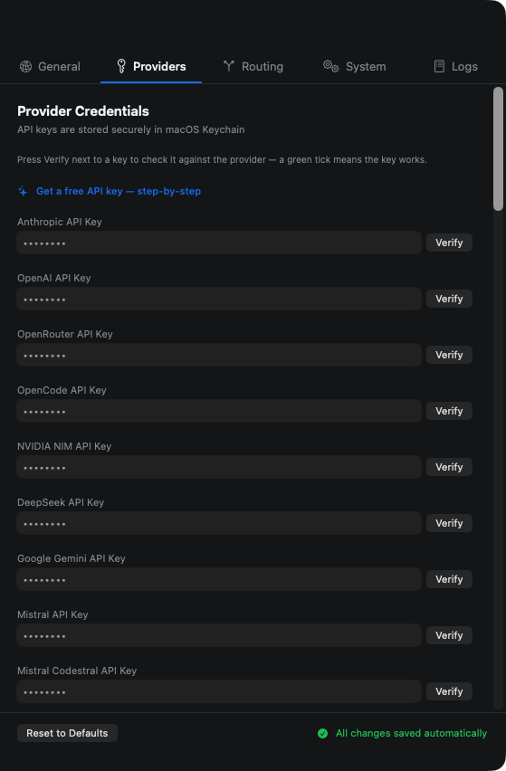

# Getting Free API Keys — A Step-by-Step Guide for Everyone

*No coding, no terminal, no jargon. If you can use a web browser and copy & paste, you can do this.*

JXProxy routes your AI requests through a **provider** — a company that runs the AI models. Some providers charge money. The two recommended here are **free**:

| Provider | Cost | API key needed? |
|---|---|---|
| **OpenCode Zen** | Free | ❌ No — works out of the box |
| **NVIDIA NIM** | Free (with a free account) | ✅ Yes — one free key |

This guide walks you through both, from zero to a working setup. It takes about 10 minutes.

---

## What is an "API key" anyway?

An API key is just a **secret code** that tells the provider "this request belongs to this account". Think of it like the password to your email — you paste it into JXProxy once, it's stored safely in your Mac's Keychain, and you never need to think about it again.

- **Don't share it** with anyone (it's like giving out your password).
- If it leaks, most providers let you delete it and create a new one.

---

## Option A: OpenCode Zen (no key needed — easiest)

This is JXProxy's **default provider**, and it requires **no API key at all**. There is nothing to sign up for and nothing to paste.

### What to do

1. Open the **JXProxy** app (bolt icon in your menu bar).
2. Click the gear icon to open **Settings**.
3. In the **General** tab, make sure **Default Provider** is set to **OpenCode Zen** (it is by default).
4. Pick a free model for **Default Model** — for example `big-pickle` or anything ending in `-free` (like `nemotron-3-super-free` or `mimo-v2.5-free`). Those are the free models.
5. Click **Start** in the main window. That's it — you're running on free AI.

> **Why is it free?** OpenCode runs a gateway with free models that work anonymously. No account, no credit card, no key. It's the zero-effort option.

> **Want more (optional)?** If you'd like your own account (better limits, usage tracking), you can create one at [opencode.ai](https://opencode.ai) — the sign-in page at [opencode.ai/auth](https://opencode.ai/auth) lets you generate an API key under your account settings — then paste it into the **OpenCode API Key** field on the **Providers** tab. Not required, though.

---

## Option B: NVIDIA NIM (free API key)

NVIDIA gives you a free key with **1,000 free credits** to start (trial accounts can request up to 5,000). Free keys have a limit on requests per minute, which is fine for everyday use.

### Step 1 — Go to the sign-up page

Open your web browser (Safari, Chrome, Edge — any) and go to:

**https://build.nvidia.com**

### Step 2 — Sign in or create a free account

1. In the top-right corner, click **"Get API Key"** (or **"Sign In"**).
2. If you already have an account, sign in. Otherwise:
   - Click **Sign Up / Register**, or simply **Continue with Google** / **Continue with GitHub** — the easiest options.
   - Or create an account with your **email address** and a password.
3. They may ask you to **verify your email** (click the confirmation link they send you) and sometimes a quick **phone verification**. That's normal.

### Step 3 — Generate your API key

1. Once logged in, you'll land on a page with lots of AI models. Don't worry about choosing one yet.
2. Look for the **"Get API Key"** button (often in the top-right or in your account menu) and click it.
3. Click **"Generate Key"** (or "Create Key"). You may be asked to give the key a name — you can type anything, like "JXProxy", or leave it blank.
4. **Copy the key immediately.** It looks like a long string of letters and numbers (usually starts with `nvapi-...`).

> ⚠️ **Important:** NVIDIA shows your full key **only once**. If you close the page without copying it, you'll have to generate a new one. Copy it to your clipboard now (right-click → Copy, or Cmd+C).

### Step 4 — Paste the key into JXProxy

1. Open the **JXProxy** app (bolt icon in your menu bar).
2. Click the gear icon to open **Settings**.
3. Go to the **Providers** tab.
4. Find **"NVIDIA NIM API Key"**.
5. Click in the box, paste your key (**Cmd+V**), or use the **Paste** button.
6. Click **Verify** — you should see a **green tick** and the word **Connected**.

### Step 5 — Select NVIDIA as your provider

1. Go to the **General** tab.
2. Set **Default Provider** to **NVIDIA NIM**.
3. Pick a model from the list (for example `nvidia/glm-5.2` or `nvidia/deepseek-v4`).
4. Click **Start** in the main window.

That's it — you're now running on NVIDIA's free tier.

---

## Adding the key to JXProxy (same for any provider)

Wherever you got a key, the app works the same way:

1. **Settings → Providers** tab.
2. Find the field matching your provider (e.g. "DeepSeek API Key", "Groq API Key").
3. **Paste** the key.
4. Click **Verify** — a **green tick** means it works. A red message tells you what's wrong.
5. In **General**, set that provider and model, then **Start**.

Keys are stored in your **macOS Keychain**, not in files — safe and private.

---

## Other free options worth knowing

| Provider | Key | Where to get it |
|---|---|---|
| **DeepSeek** | Free tier | [platform.deepseek.com](https://platform.deepseek.com) → API Keys |
| **Groq** | Free tier (fast!) | [console.groq.com](https://console.groq.com) → API Keys |
| **GitHub Models** | Free with a GitHub account | [github.com/marketplace/models](https://github.com/marketplace/models) → get a token |
| **Ollama (local)** | No key — runs on your Mac | Nothing to sign up for (uses your own computer) |

---

## Troubleshooting — if something doesn't work

**"Verify" shows a red message**
- Check you copied the **whole** key — no missing first/last characters, no extra spaces.
- Wait a minute and try again — brand-new accounts sometimes take a moment to activate.
- Make sure you're pasting into the field for the **same provider** you got the key from.

**I get "rate limited" or "too many requests"**
- Free tiers limit how many requests per minute you can make. Wait a few seconds and try again. This is normal and temporary.

**The models list is empty**
- Click the **refresh** button next to the model dropdown. If a key is needed, enter it first, then refresh.

**Still stuck?**
- Click the **?** icon in the JXProxy window to reopen the built-in tutorial, or check the **Logs** tab in Settings — it shows what's happening with each request.
